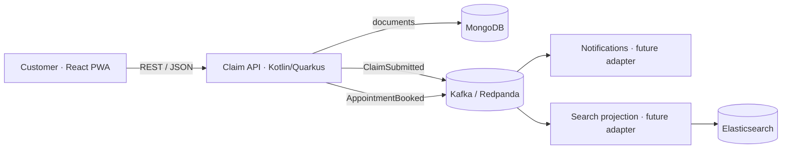

# Architecture

## Aggregate and consistency model

`ClaimEntity` is the aggregate root. A claim can only be changed while its status is `DRAFT` or `READY`. Submission moves it to `SUBMITTED`, and booking moves it to `APPOINTMENT_BOOKED`. These invariants are enforced by the domain layer rather than delegated to the user interface.

For production, direct event publishing should be replaced with a **transactional outbox** stored in the same MongoDB transaction. A relay would publish each event to Kafka idempotently, removing the dual-write risk between the database and the broker.

## Future service boundaries

`Claims` owns reporting and triage; `Appointments` owns calendars and bookings; `Search` maintains a denormalized query projection; `Notifications` translates domain events into email, SMS, or push messages. For the MVP, claims and appointments remain modules in the same deployment to keep operational complexity proportional to the problem.

## Security work required before production

- OIDC/OAuth2 and claim-owner authorization
- Attachment encryption and configurable retention
- Malware scanning and EXIF metadata removal
- Append-only audit trail and consent management
- Rate limiting, Content Security Policy, and secret management
- DPIA and legal validation of the CAI/signature process
